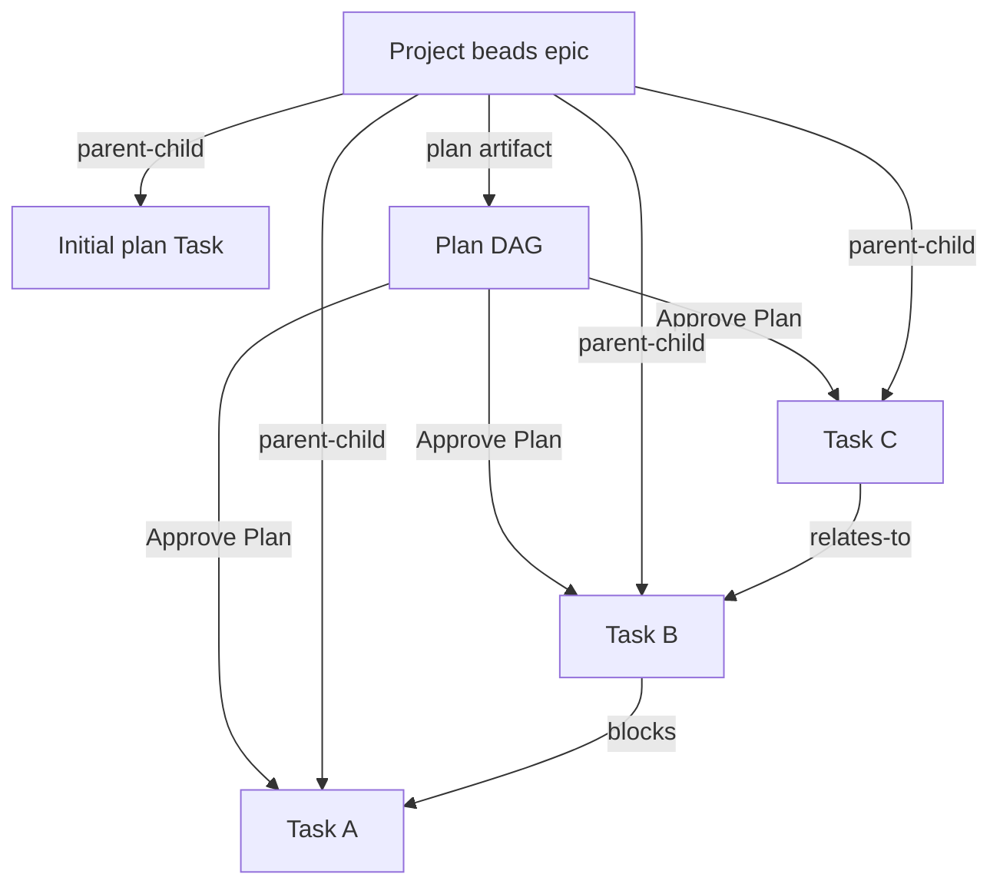
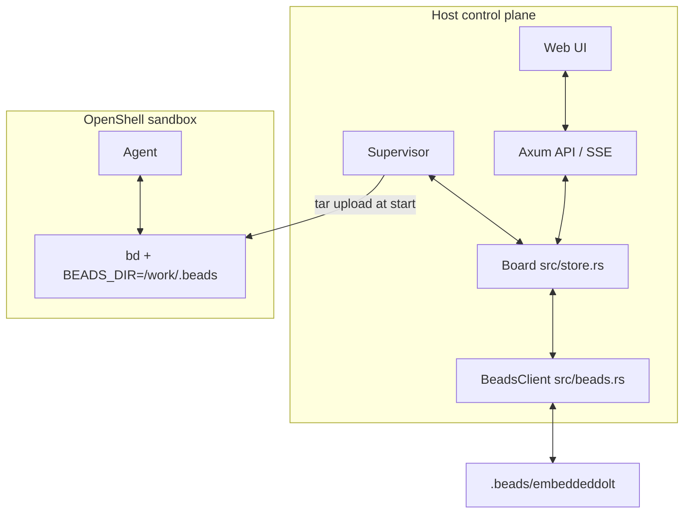
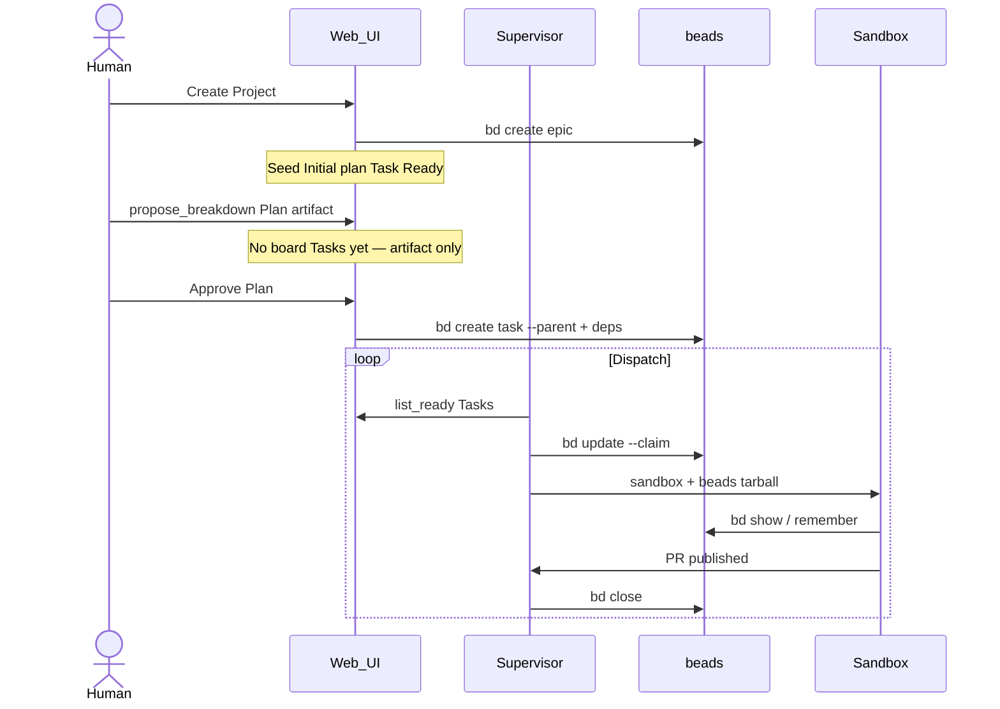

# Architectural Design Specification: Plan A (`honr-beads`)

> **Objective:** Integrate **`gastownhall/beads`** (`bd`) as the identity + graph
> store for honr, with a flattened work model: **Project** containers and **flat
> Tasks** linked by dependency edges — not a Vision→Epic→Story ladder.

---

## Work breakdown model (locked)

| Concept | Beads | Honr |
|---|---|---|
| Project | `issue_type: epic`, root | Container, not claimable, Board swimlane header only |
| Plan | (honr artifact; optional beads note later) | Source of truth: Tasks + keys + deps + DoDs |
| Initial plan Task | `issue_type: task`, `--parent=<project>` | Seeded Ready Task; writes/refines the Plan |
| Task | `issue_type: task`, `--parent=<project>` | Only claimable Board unit |
| Ordering | `bd dep add` (`blocks`, `relates-to`) | `blocked_by` projection + ready filter |
| Split | Sibling tasks under same Project | Original Task → Done |

Lifecycle: create Project → seed Initial plan Task (Ready) → `propose_breakdown`
writes Plan artifact → human **Approve Plan** materializes Tasks to Ready.
The Project itself never enters Ready.

---

## System architecture

### Storage split

- **Beads** — canonical hash ids, Project→Task parent edges, task↔task deps,
  open / in_progress / closed, `bd remember` / `bd prime`.
- **honr.json / in-process** — rich lifecycle (Shaping/Ready/Claimed/Running/…),
  lease, sandbox name, live cost, PR URL, escalations.

### Control plane (`BeadsClient`)

- `create_linked` — Project as epic, Task as task with `--parent`
- `dep_add` — `blocks` / `relates-to`
- `list_ready` / `claim` / `close` / `set_status`
- `schedule_beads_mirror` on Board after create / split

### Sandbox

- `bd` baked into `sandbox/Containerfile`
- Host `.beads` tarball uploaded; `BEADS_DIR=/work/.beads`
- Briefing: sibling split only; `bd show` / `bd remember` / `bd dep add`

### UI

- Home: Project cards with plan status (`no_plan` / `awaiting_approval` / `approved_vN`)
- Board: Project swimlane headers only; columns hold Tasks (never the Project)
- Project detail: **Approve Plan** (not “publish Project to Ready”)
- Cards prefer beads hash ids over sequential `#n`

---

## Lifecycle

---

## Status

Phase 1 eval and this model cutover are landed in-tree:

- [x] Project + Task schema (`honr.yaml`)
- [x] Flat create / sibling split / MCP breakdown
- [x] Plan artifact + Initial plan seed Task + Approve Plan materialize
- [x] `BeadsClient` + dual-write mirror
- [x] Sandbox `BEADS_DIR` sync + briefing
- [x] UI Home / Board swimlanes / beads id display

Still open: full replacement of `honr.json` identity (integer `ItemId` remains
the board key; beads hash is mirrored and shown). Supervisor-run gates (#10)
unchanged and still highest value.
